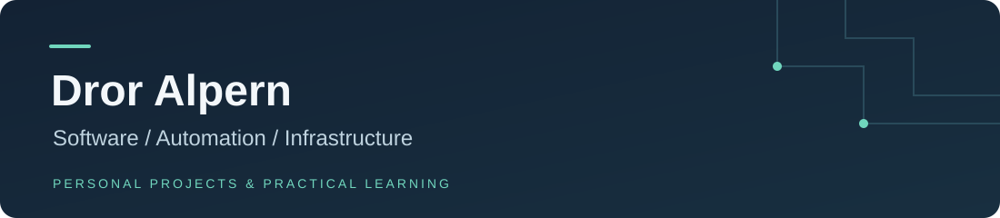

  

  <a href="https://www.linkedin.com/in/dror-alpern/">LinkedIn</a>
  &nbsp; · &nbsp;
  <a href="https://github.com/DrorAlpern/DrorAlpern/blob/main/PROJECTS.md">Project notes</a>

I work in IT support and build personal projects that connect software, automation, and infrastructure. My projects range from a vinyl content app and a home lab to monitoring tools and e-commerce workflows.

I'm currently studying DevOps and applying what I learn in a Linux lab.

## Featured projects

| Project | What it does | Stage |
| --- | --- | --- |
| **[VinylAgent](https://github.com/DrorAlpern/DrorAlpern/blob/main/project-notes/vinylagent.md)** | Organizes vinyl-related content, drafts, and performance data; connects application services to workflow automation. | Personal app in development |
| **[Infrastructure Automation](https://github.com/DrorAlpern/DrorAlpern/blob/main/PROJECTS.md#infrastructure-automation)** | Validates machine definitions in Python, simulates provisioning, and configures a real Nginx service through Bash. | Course project · Stage 1 verified |
| **[Home Server](https://github.com/DrorAlpern/DrorAlpern/blob/main/project-notes/home-server.md)** | A Proxmox lab for Linux, containers, application deployment, monitoring, and backups. | Personal lab |

## More projects

| Project | Focus | Stage |
| --- | --- | --- |
| **[Server Monitor](https://github.com/DrorAlpern/DrorAlpern/blob/main/PROJECTS.md#server-monitor)** | Service checks, workflow errors, and Telegram alerts. | Lab automation |
| **[n8n Practice](https://github.com/DrorAlpern/DrorAlpern/blob/main/PROJECTS.md#n8n-practice)** | HTTP requests, JSON processing, error handling, and AI agent exercises. | Course exercises |
| **[HomeNet Monitor](https://github.com/DrorAlpern/DrorAlpern/blob/main/PROJECTS.md#homenet-monitor)** | A dashboard for home-network devices and guest-network observations. | Prototype |
| **[BurnMonitor V2](https://github.com/DrorAlpern/DrorAlpern/blob/main/PROJECTS.md#burnmonitor-v2)** | Investigating the flow between scheduled data exports, an API, and dashboard updates. | In development |
| **[TovPup / CommerceAI](https://github.com/DrorAlpern/DrorAlpern/blob/main/PROJECTS.md#tovpup-and-commerceai)** | E-commerce tooling, structured product information, and launch-readiness workflows. | In development |
| **[SHAPE & DEFORM](https://github.com/DrorAlpern/DrorAlpern/blob/main/PROJECTS.md#shape-and-deform)** | Tools for validating print files, preparing digital packages, and organizing listing information. | Tooling prepared; pilot pending |

## Tools I use and practice

**Infrastructure** 
`Linux` `Ubuntu` `Proxmox` `Docker` `Docker Compose` `Tailscale` `Nginx`

**Development and data** 
`Python` `Bash` `PowerShell` `JavaScript` `Node.js` `SQLite` `PostgreSQL`

**Automation and integration** 
`n8n` `REST APIs` `JSON` `Webhooks` `Git` `GitHub`

## How I work

I start with a practical problem, build in stages, and document what works and what still needs attention. I use AI tools to support development and troubleshooting, while focusing on understanding the workflow, reviewing changes, and verifying results.

These are personal projects and learning exercises. The [project notes](https://github.com/DrorAlpern/DrorAlpern/blob/main/PROJECTS.md) describe their scope and current limitations. Source availability varies by project.
